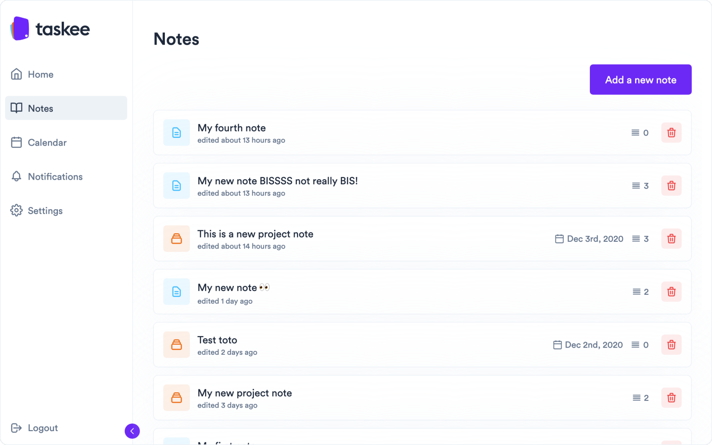
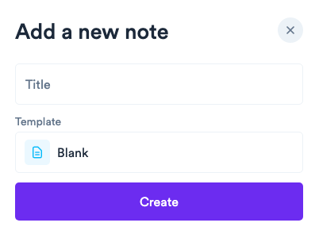
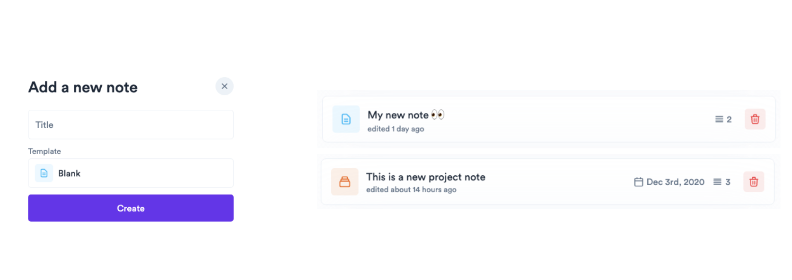
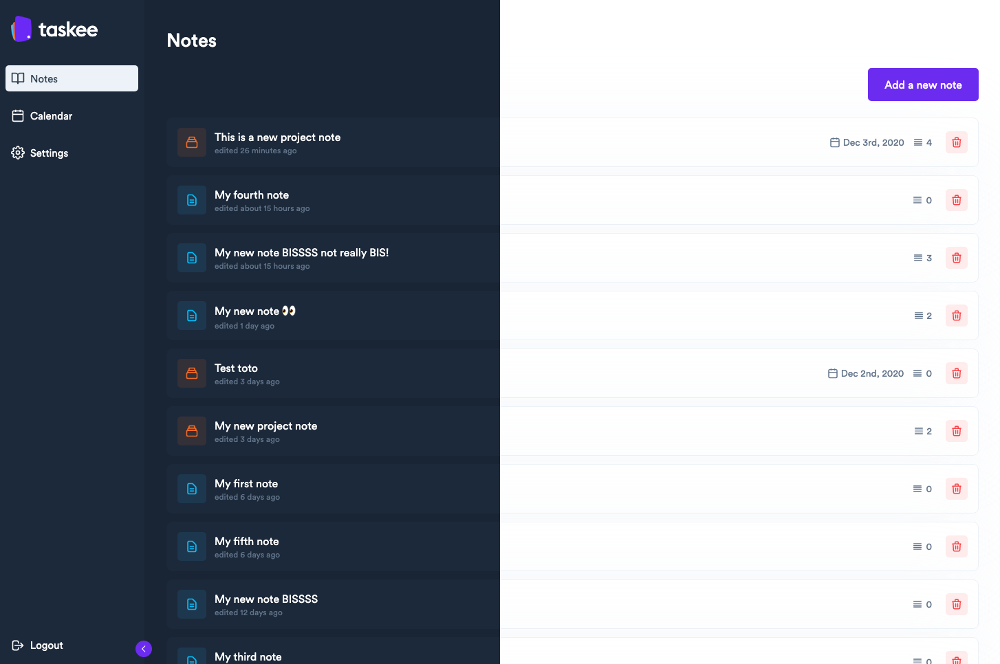
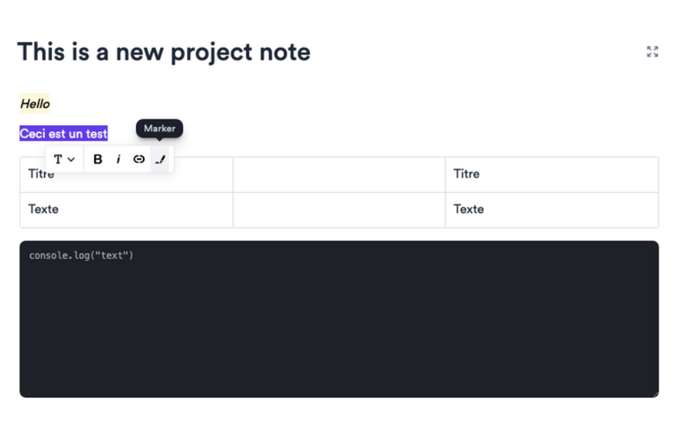
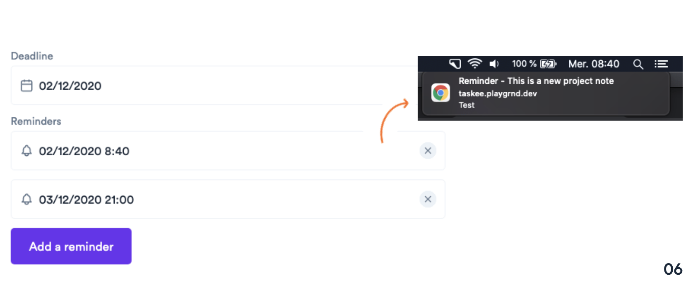
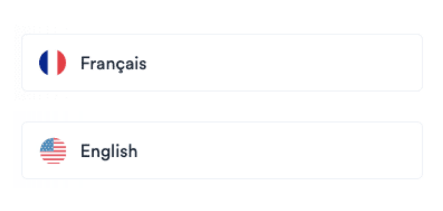
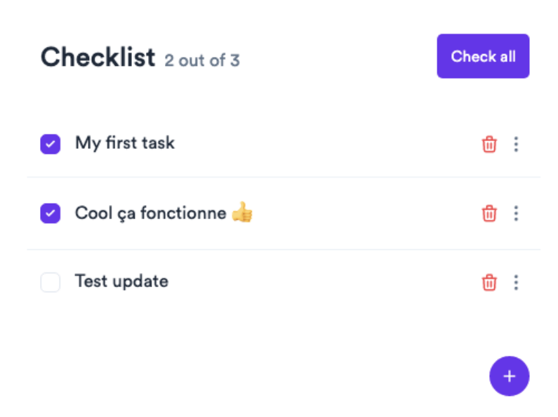

# Taskee

## **Installation 🚀**

Install dependencies
	
    yarn install
	
Setting up environnement

    REACT_APP_API_URL=taskee_api_url
    REACT_APP_BASE_NAME=app_name
    REACT_APP_PUSHER_APP_KEY=pusher_app_key
    REACT_APP_PUSHER_APP_CLUSTER=region

## **Backend API source code ⚙️** 

[taskee-api](https://github.com/codebynao/taskee-api)

## **Screens 🖥**

Notes screen

Create new note

Templating

Dark theme / Light theme

Editor screen

Deadline note reminder and notification

Language selector

Checklist

## **Collaborators 🤖**

[Abdessalam BENHARIRA](https://github.com/itsabdessalam/taskee)

[Floran MAITTE](https://github.com/Floran-mtte)

[Naomi PAULMIN](https://github.com/codebynao)

[Paul TEDESCO](https://github.com/PaulTedesco)
